# A Self healing application deployed using custom MI
The goal of this project is to deploy a self healing appication across multiple zones in a single region which includes features such as autoscalling and health checks. I will be using a simple java application for this project.
  
**Requirements:**
+ Google billing account
+ Java app which can be containerized and which also have a RDS
+ Have a basic understanding of cloud services

# Creating MI with Packer and Ansible/Shell:

***Why are we doing this?***

By pre-building machine images using Packer and provisioner (Here i used shell script) , you have ready-to-use images that contain your application and configurations. When autoscaling, these pre-baked images can be launched much faster than provisioning instances from scratch. This reduces the time it takes to add new instances to your environment, minimizing downtime.

**Packages to be Provisioned:**
+  [Docker](https://docs.docker.com/get-docker/)
+  [Git](https://git-scm.com/downloads)
+  [Cloud ops agent](https://cloud.google.com/stackdriver/docs/solutions/agents/ops-agent)

***Install the following on a VM Instance:***
+ [Jenkins ***( Refer docs )***](https://www.jenkins.io/download/)
+ [Git](https://git-scm.com/downloads)
+ [Packer ***(>v1.7.0)***](https://www.packer.io/) #1.7.0 and later versions include the init command.

**Steps:**
1. Configure an VM and Install the above packages.
2. Configure an firewall rule named ***'allow-jenkins'*** to enable tcp-connection on port 8080.
3. Create a new repository named ***'packer'*** (your name) and upload your `Jenkinsfile`,`*.pkr.hcl` file and `provisioner.sh` file (If you are using ansible, upload your playbook file instead) 
4. Once you setup the Jenkinsfile, Navigate to ***http://[ExternalIP]:8080*** to access the Jenkins server.
5. Store the gcp service account keys (which has necessary permissions) in Jenkins Credentials.
6. Create a Jenkins CI Pipeline with the packer repository using git SCM. Make sure to change Branches to build option from ***Master*** to ***main***.
7. Run the Pipeline using my Jenkinsfile and check if everything is Green, then proceed to the next step.
8. Finally go to **Console --> Compute engine --> Images**. You can see our freshly created image on the screen. 

 
> ***NOTE: Dont store your Cloud credentials/secrets on any public repository. In this Demo I used Jenkins Credentials to store the Secrets of my gcp service account.***

<strong>Result</strong>

<h3>Pipeline Successfull !!</h3>
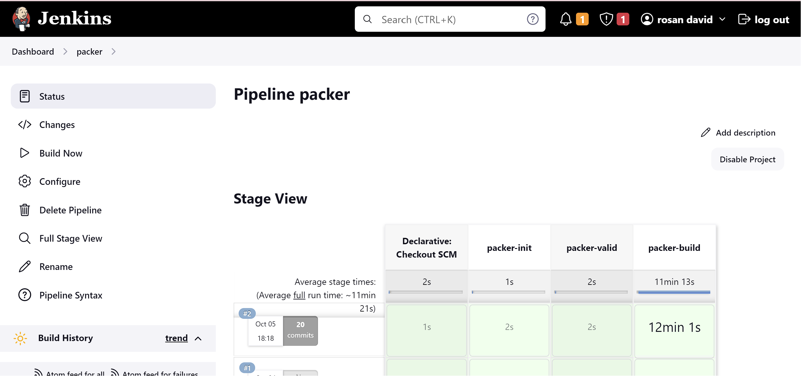
 
<h3>Custom Image Created !!</h3>
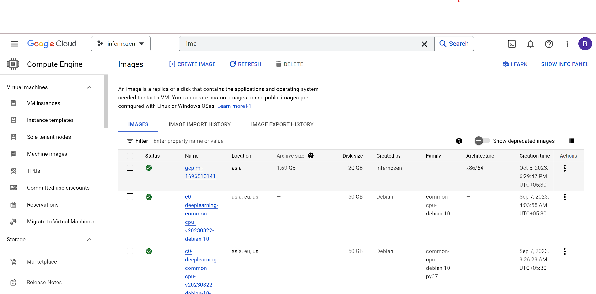

==================== I will upload a demo video here =====================

# Building and Pushing Docker Images with Security checks:
***Why are we doing this?***

Building and pushing Docker images with security checks is imperative to safeguard our applications and infrastructure. These security checks, integrated into our CI/CD pipeline, proactively identify and mitigate vulnerabilities within our code and dependencies, reducing the risk of security breaches and ensuring the integrity of our containers. By addressing potential threats at the image-building stage, we fortify our applications against known vulnerabilities, making them more resilient and secure when deployed

> In this project, I'll be setting up multiple pipelines tailored for specific needs. For instance, we won't need to generate machine images with the same frequency as building Docker images. Machine image updates are likely to be less frequent in comparison to Docker image builds.

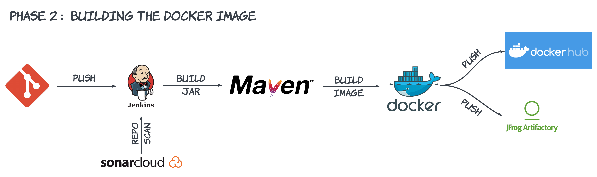

 ***Prerequisites:***
 + Java version 17 or later
 + Maven tool on jenkins
 + Sonarcloud Account
 + Docker and Dockerhub private repository
 + Jfrog Account (Free trial is enough)

**Steps:**
1. Fork this [spring-petclinic](https://github.com/spring-projects/spring-petclinic) repository or Create your own repository with the Java app on your github.
2. Go to **Home --> Manage Jenkins --> Tools** and select **Maven-3.9.4** for automatic install.
3. Go to Sonarcloud.io and create your own project ***(Note: down the Project key along with Sonar tokens).***
4. Replace the project key of yours in the `petclinic/Jenkinsfile`.
5. Create a Dockerhub private repository for storing the Images.
6. Create a Jfrog (Docker registery) for storing the Images. (use either dockerhub or Jfrog)
7. Navigate to your Jenkins server and add the `docker-credentials`,`Jfrog-credentials` and the `Sonar-token`.
8. Add the `Jenkinsfile` , `Dockerfile` to the forked repository.
9. Create a new Pipeline and connect with your github repository.
10. Run the pipeline. If the pipeline is successfull you can see the Image available on the Dockerhub.

<strong>Result</strong>

<h3 padding-up=0>Sonar Cloud Scan Reports</h3>
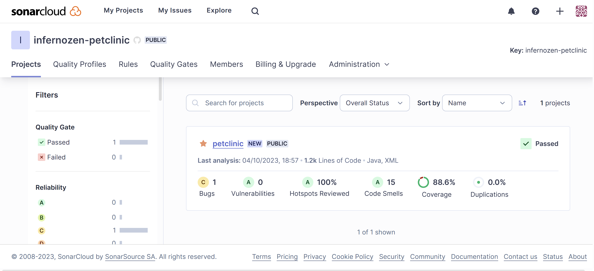
 
<h3>Pipeline successfull !!</h3>
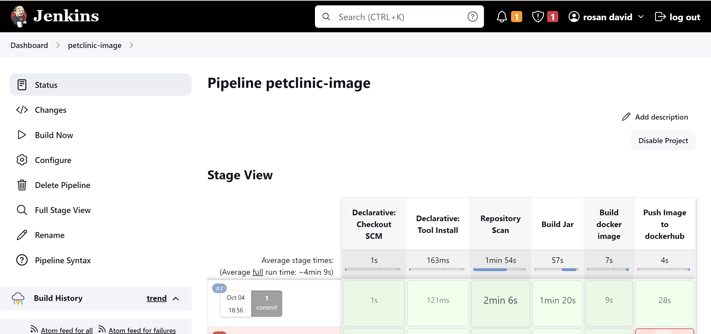
 
<h3>Dockerhub updated!!</h3>
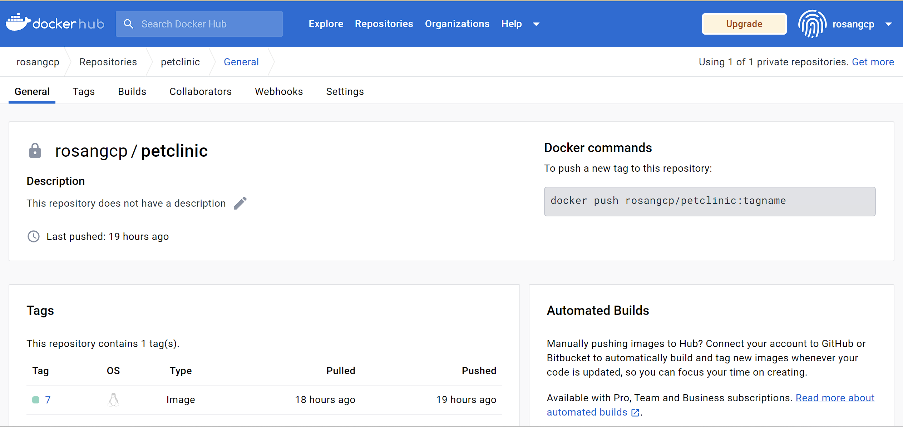

==================== I will upload a demo video here =====================

# Creating Iac with Terraform (Final Phase):
***Why are we doing this?***

In this final phase of our IaC project using Terraform, we are driven by several crucial objectives. Our primary aim is to automate infrastructure provisioning and management for increased efficiency, reduced errors, and faster deployments. Scalability and flexibility are paramount, allowing us to adapt to changing demands seamlessly. IaC ensures consistency, reproducibility, and better version control, enhancing infrastructure reliability.

 ***Prerequisites:***
 + Terraform V1.6.0 or later
 + A Service Account with Necessary Permissions
 + Jenkins Server
   

<strong>Architecture Diagram</strong>

  

**Steps:**
1. Setup **Terraform** on your **jenkins-host** (Make sure `default_application_credentials` have necessary permission).
2. Copy the terraform code from this github repository to your own repository.
3. Replace the Required parameters such as `project-id`,`image`,`bucket-name` with your own acquired resources.
4. Create a **New Pipeline** and connect with your github repository.
5. Run the pipeline. If the pipeline is successfull, The web-app will be available in the specified domain.

> Make sure to update nameserver of your Domain name registrar's nameserver with your host DNS Zone's nameservers. Or else the domain wont be up.

<strong>Result</strong>

<h3 padding-up=0>Pipeline Successfull !!</h3>
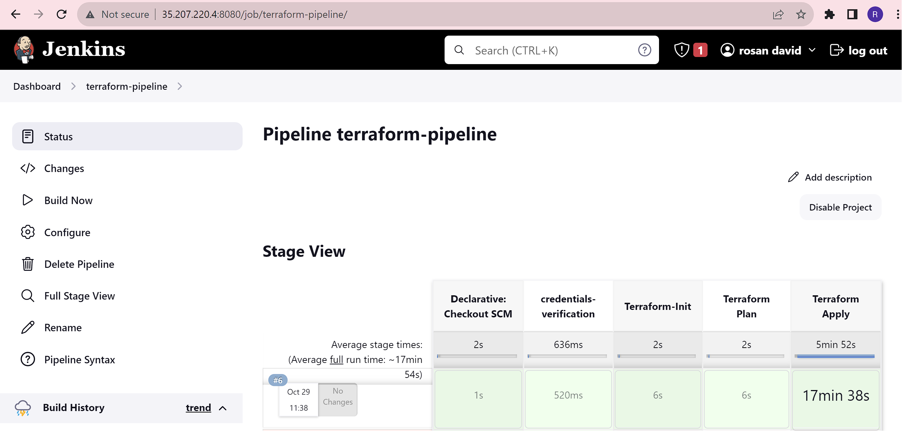 
<h3>Website is Up !!</h3>
 
<h3>Testing Database Connectivity !!</h3>
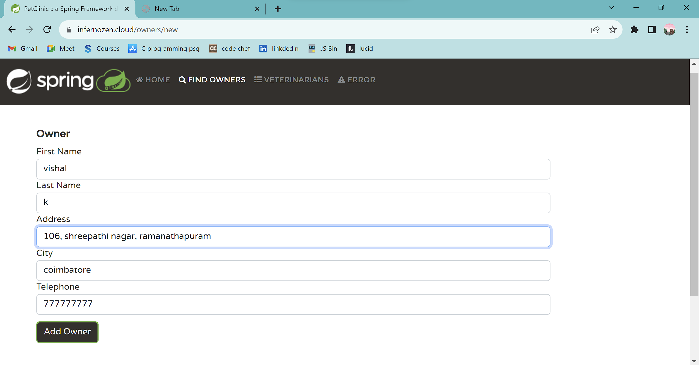 
<h3>Connection Successfull !!</h3>
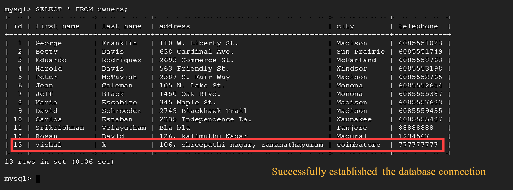 

<strong>Verify Infrastructure</strong>

<h3 padding-up=0>FirewallRules Verify !!</h3>
 
<h3>VM verify !!</h3>
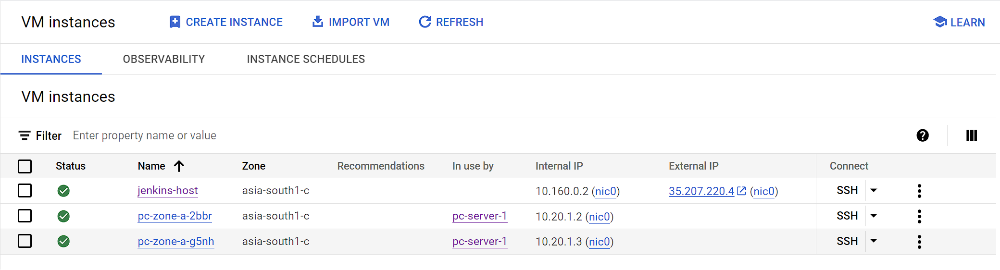 
<h3>MIG verify !!</h3>
 
<h3>Cloud SQL verify !!</h3>
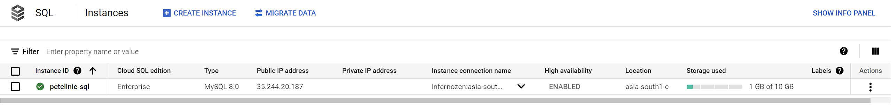 
<h3>Cloud NAT verify !!</h3>
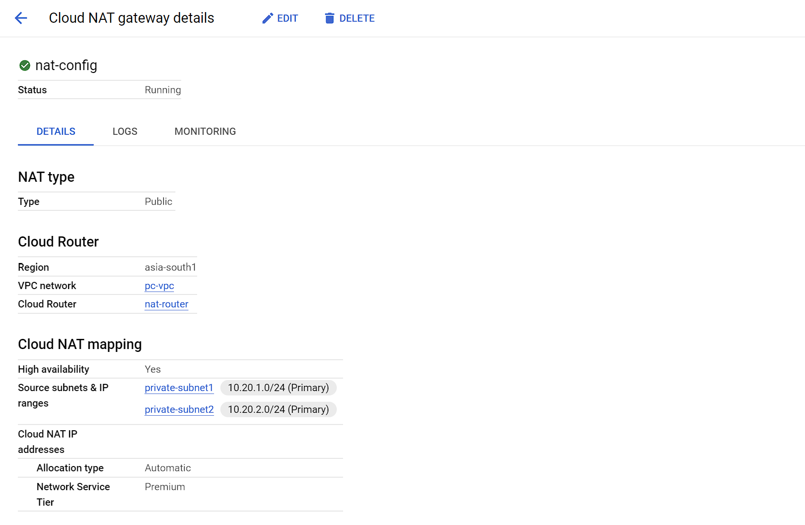 
<h3>Cloud LoadBalancer verify !!</h3>
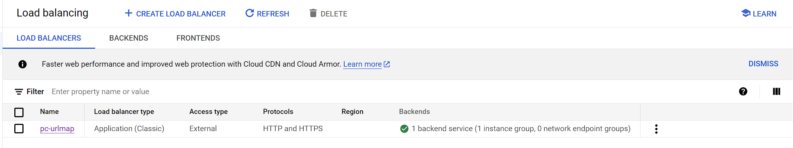 

==================== I will upload a demo video here =====================
