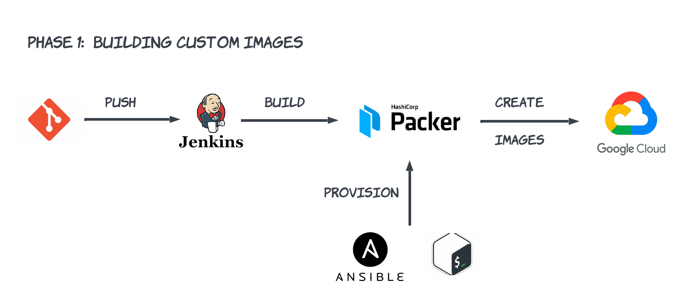

# A Self healing application deployed using custom MI
The goal of this project is to deploy a self healing appication across multiple zones in a single region which includes features such as autoscalling and health checks. I will be using a simple java application for this project.
  
**Requirements:**
+ Google billing account
+ Java app which can be containerized and which also have a RDS
+ Have a basic understanding of cloud services

# Creating MI with Packer and Ansible/Shell:

***Why are we doing this?***

By pre-building machine images using Packer and provision (Here i used shell script) , you have ready-to-use images that contain your application and configurations. When autoscaling, these pre-baked images can be launched much faster than provisioning instances from scratch. This reduces the time it takes to add new instances to your environment, minimizing downtime.

# Currently working on phase 1
